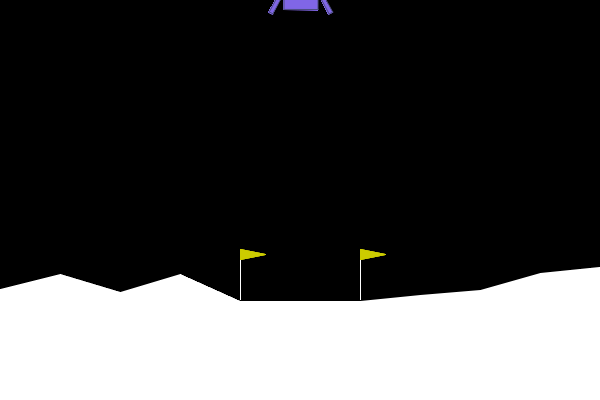
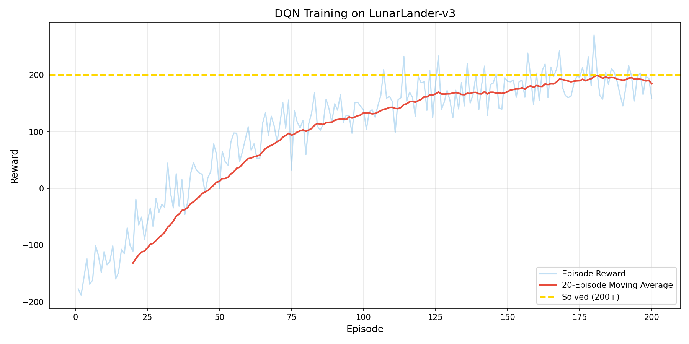
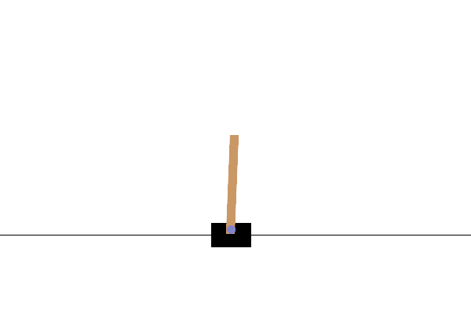
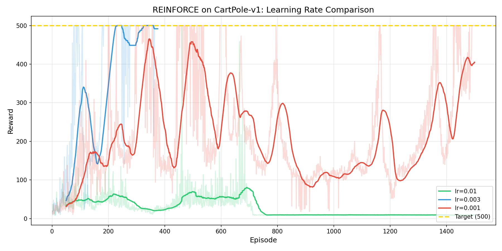
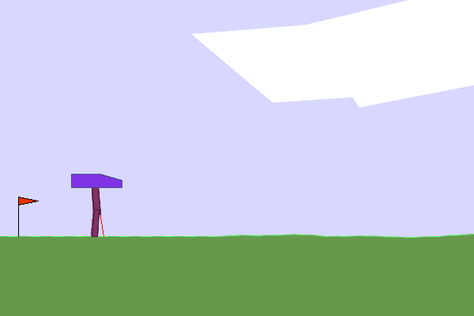
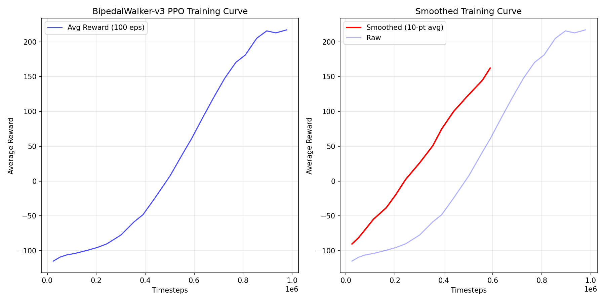

# Gymnasium RL Experiments

Three classic reinforcement learning experiments covering Value-based, Policy-based, and Actor-Critic methods.

## 🎮 Experiments

| Experiment | Environment | Algorithm | Key Techniques |
|------------|-------------|-----------|----------------|
| 🚀 LunarLander | Moon landing | DQN | Experience Replay, Target Network |
| 🎯 CartPole | Pole balancing | REINFORCE | Policy Gradient |
| 🦿 BipedalWalker | Bipedal walking | PPO | Clipped Objective, GAE |

## 🎬 Demo Results

### 🚀 LunarLander (DQN)
Control a lander to safely touch down on the moon surface. Target reward > 200.

<p align="center">
  
</p>

<p align="center">
  
</p>

---

### 🎯 CartPole (REINFORCE)
Balance a pole on a cart for 500 steps by moving left/right. Comparing 3 learning rates.

<p align="center">
  
</p>

<p align="center">
  
</p>

---

### 🦿 BipedalWalker (PPO)
Control a bipedal robot to walk forward. Target reward > 300.

<p align="center">
  
</p>

<p align="center">
  
</p>

---

## 📦 Installation

```bash
pip install gymnasium[box2d] torch stable-baselines3 imageio matplotlib
```

## 🚀 Quick Start

```bash
# Run all demos
python run_demo.py --env all

# Run individual experiments
python run_demo.py --env lunar      # Moon landing
python run_demo.py --env cartpole   # Pole balancing
python run_demo.py --env bipedal    # Bipedal walking
```

## 📁 Project Structure

```
gymnasium-experiments/
├── run_demo.py                    # One-click demo script
├── lunar-lander-dqn/
│   ├── dqn.py                     # DQN implementation
│   ├── train.py                   # Training script
│   ├── model_best.pth             # Trained model
│   ├── training_curve.png         # Training curve
│   └── lunar_lander_trained.gif   # Demo GIF
├── cartpole-reinforce/
│   ├── reinforce.py               # REINFORCE implementation
│   ├── policy_model.pth           # Trained model
│   ├── training_curve.png         # LR comparison curve
│   └── cartpole_reinforce.gif     # Demo GIF
└── bipedal-ppo/
    ├── train.py                   # PPO training script
    ├── bipedal_ppo_model.zip      # SB3 model
    ├── training_curve.png         # Training curve
    └── bipedal_walker.gif         # Demo GIF
```

## 📊 Training Results

- **LunarLander**: ~200 episodes to reach reward > 200
- **CartPole**: ~700 episodes to reach max score 500
- **BipedalWalker**: ~800K steps to reach reward > 250

## License

MIT
